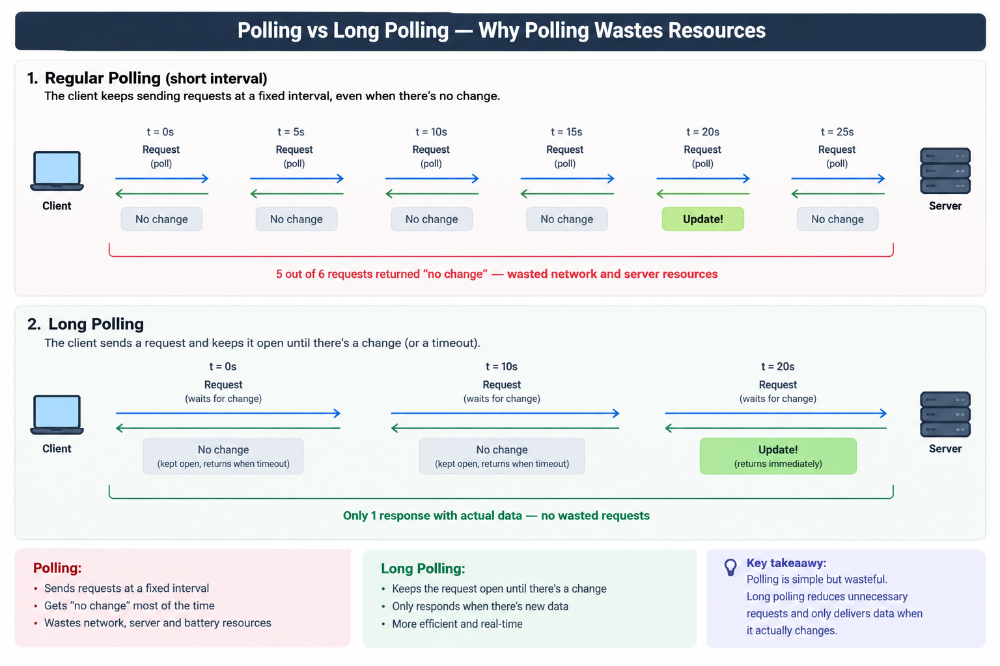

# Long Polling

An optimization on top of [polling](<polling.md>): instead of the server always answering
immediately, it *holds the request open* until there's actually something to say (or a
timeout is hit). This trades a bit of server complexity for far fewer wasted round trips.

## How it works

1. Client sends a request: "anything new?"
2. Server does **not** answer right away. It parks the request and waits.
3. As soon as new data is available (or a timeout expires, e.g. 30s), the server responds.
4. Client immediately re-issues a new request the moment it gets a response.

From the outside it still looks like plain request-response - same protocol, same headers -
but the *timing* is different: responses arrive exactly when something happened, not on a
fixed clock tick.

## Where it's used

- Chat apps before WebSockets were widely supported
- Notification systems (older AJAX-based "comet" techniques)
- Any API that wants near-real-time updates without upgrading the protocol (no WebSocket/SSE
  support needed on either end)

## Pros / Cons

**Pros:** far fewer wasted requests than plain polling, lower latency for updates (server
responds the instant something changes, not on the next tick), works over plain HTTP.

**Cons:** ties up a server connection/thread per waiting client - doesn't scale as well as
a true push mechanism; still has to re-establish a new HTTP request after every response
(a small amount of overhead per update); a timeout with no data is itself a wasted round trip.

🖼️ **long polling sequence diagram**

## Practice project

[`practice/comms-design-pattern/notification-delivery`](../../practice/comms-design-pattern/notification-delivery) -
the server holds the HTTP response open until an in-memory "event" fires or a timeout
elapses; the client re-requests immediately after each response so you can watch it
re-connect the instant it gets an answer.

## Related

- [Polling](<polling.md>) - the naive version this improves on.
- [Server-sent events](<server-sent-events.md>) - a standardized, more efficient way to get
  server-initiated updates without repeatedly re-opening connections.
