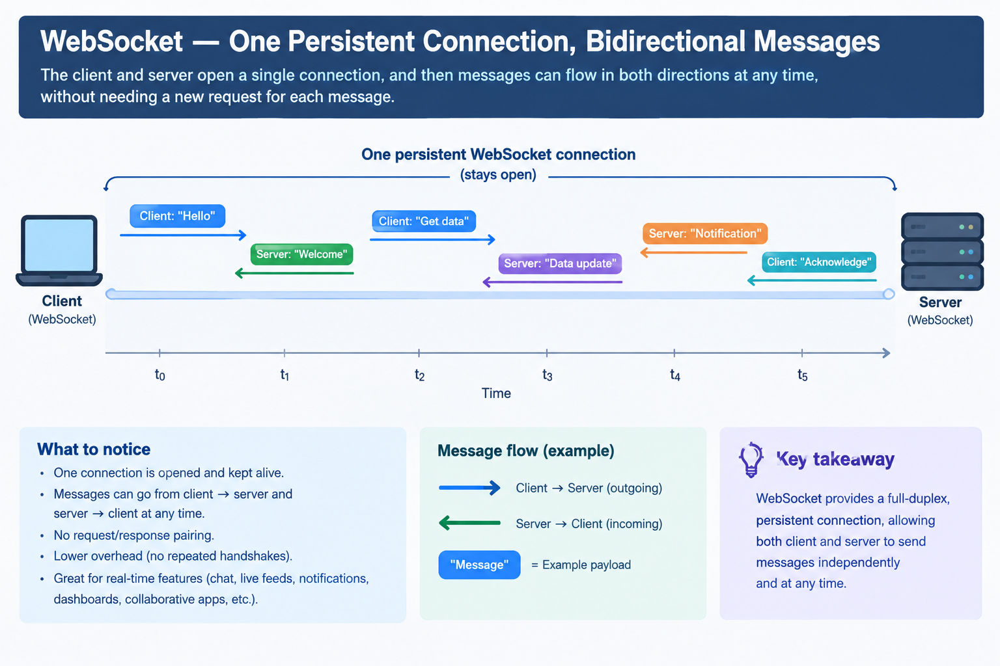

# Push

The general pattern behind [server-sent events](<server-sent-events.md>), WebSockets, mobile
push notifications (APNs/FCM), and MQTT: the server sends data to the client **without the
client asking first**, over a connection that's kept open specifically for that purpose.

This note covers push as the general concept; SSE is one concrete, HTTP-based flavor of it.

## How it works

1. Client establishes a connection and tells the server "keep me posted" (subscribes).
2. Connection is kept open (a persistent socket, not a request that completes).
3. Whenever the server has something to say, it writes directly to that open connection —
   no request from the client triggers it.
4. Client reads whatever arrives, whenever it arrives.

The defining difference from every request-response-based pattern
([polling](<polling.md>), [long polling](<long-polling.md>)): the server can be the one to
*initiate* a message. That's only possible because there's a connection sitting open,
dedicated to this client, that the server can write to at any time.

## Where it's used

- WebSockets (full bidirectional push — client and server can both send anytime)
- Mobile push notifications (APNs for iOS, FCM for Android) — the OS keeps one connection
  open to the push service on behalf of *all* apps, and routes messages to the right app
- MQTT (IoT devices getting pushed commands/config)
- Real-time multiplayer games, live collaboration tools (e.g. cursors moving in a shared doc)

## Pros / Cons

**Pros:** lowest possible latency (no polling interval, no waiting for a request to land),
no wasted "anything new?" requests at all.

**Cons:** every subscribed client holds a connection open on the server — this is the
biggest scaling cost of the whole module (millions of idle-but-open sockets); needs
infrastructure that supports long-lived connections (some proxies/load balancers assume
short-lived HTTP requests and need tuning); reconnect/backoff logic has to be handled
explicitly if the connection drops.

🖼️ **websocket persistent connection diagram**

## Practice project

[`practice/comms-design-pattern/notification-delivery`](../../practice/comms-design-pattern/notification-delivery) —
a raw TCP variant (Node's `net` module, standing in for what a WebSocket does at a lower
level) pushes a simulated "order status changed" message the moment it happens, entirely
unprompted by any client request.

## Related

- [Server-sent events](<server-sent-events.md>) — push, but specifically over HTTP and
  one-directional.
- [Pub/sub](<pub-sub.md>) — push becomes really useful once you add topics: a server pushes
  to *only* the clients subscribed to a given topic, not everyone.
