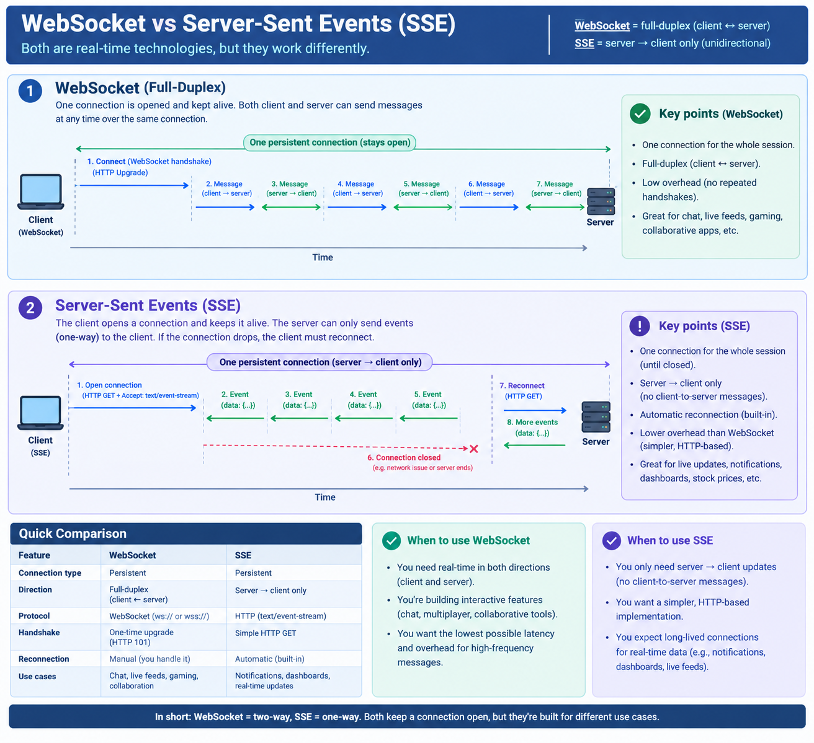

# Server-Sent Events (SSE)

A standardized way for a server to keep pushing updates to a client over a single, long-lived
HTTP connection - no re-requesting after every message like [long polling](<long-polling.md>),
and no need for a whole new protocol like WebSockets. One request, then the server just keeps
writing.

## How it works

1. Client opens a normal HTTP request, but asks for `Accept: text/event-stream`.
2. Server responds with `Content-Type: text/event-stream` and **keeps the connection open**
   instead of closing it after one response.
3. Whenever the server has something new, it writes a small text-formatted chunk:
   ```
   data: hello

   ```
   (a blank line marks the end of the event).
4. The client (in a browser, the built-in `EventSource` object) reads the stream and fires an
   event for each `data:` block, without ever having to reconnect.
5. Connection stays open indefinitely; if it drops, `EventSource` auto-reconnects.

It's built directly on HTTP - no protocol upgrade/handshake like WebSockets need - so it works
through the same proxies, load balancers, and auth as regular requests. The tradeoff is it's
**one-directional**: server → client only. The client still needs plain requests to send data.

## Where it's used

- Live dashboards / stock tickers
- Notification feeds
- Streaming progress updates (e.g. "your export is 40% done... 80%... done")
- LLM token streaming (this is literally how most chat UIs stream a model's response)

## Pros / Cons

**Pros:** simple (plain HTTP, no new protocol), built-in browser support with auto-reconnect,
plays nicely with existing HTTP infra (proxies, auth, load balancers).

**Cons:** one-directional only, text-based (no binary framing like WebSocket has), each open
connection ties up a server resource (thread/socket) for as long as the client is subscribed -
same scaling concern as long polling but for the whole session instead of per-request.

🖼️ **server sent events vs websocket diagram**


## Practice project

[`practice/comms-design-pattern/notification-delivery`](../../practice/comms-design-pattern/notification-delivery) -
the server streams a `data:` event on a single connection; since the demo client is Node (not
a browser), the raw `text/event-stream` chunks are parsed by hand so the wire format stays
visible instead of being hidden by `EventSource`.

## Related

- [Long polling](<long-polling.md>) - the "keep re-asking" alternative this replaces.
- [Push](<push.md>) - true bidirectional push (e.g. WebSockets), a step up from SSE's
  one-directional stream.
