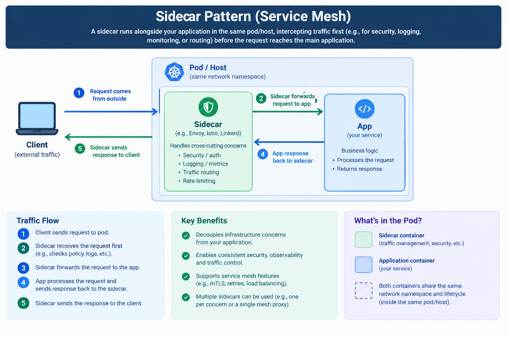

# Sidecar Pattern

An architectural pattern (not a wire protocol like the others in this module) for pulling
cross-cutting concerns - logging, metrics, retries, auth, TLS - out of application code and
into a **separate process that runs alongside it**, deployed together as a pair.

## How it works

1. The main application ("primary container") only implements business logic.
2. A second process (the "sidecar") is deployed **alongside** it - same host/pod, own process.
3. The sidecar handles some cross-cutting concern: intercepting traffic in/out, collecting
   metrics, terminating TLS, retrying failed calls, service discovery, etc.
4. The two communicate over `localhost` (or a shared volume) - cheap, low-latency, and never
   crosses a real network boundary.
5. The main app is often unaware the sidecar is even there - traffic is routed through it
   transparently (e.g. all outbound calls actually go through the sidecar proxy first).

Think of it like a motorcycle sidecar: attached to the main vehicle, goes wherever it goes,
but isn't part of the vehicle itself and could be swapped out independently.

## Where it's used

- **Service meshes** (Istio's Envoy proxy, Linkerd) - a sidecar proxy sits in front of every
  service instance, handling retries, mTLS, load balancing, and observability without the
  service's own code knowing any of it is happening.
- Log/metrics shipping - a sidecar tails the app's logs and forwards them to a central system
  (e.g. Fluentd/Fluent Bit as a sidecar), so the app just writes to stdout and doesn't need a
  logging client baked in.
- Config/secret syncing - a sidecar keeps a local file updated with the latest secrets pulled
  from a vault, so the app just reads a file.

## Pros / Cons

**Pros:** cross-cutting logic is written once and reused across every service (language
agnostic - a Python service and a Go service can share the exact same sidecar); the main app
stays focused on business logic; the sidecar can be upgraded independently of the app.

**Cons:** doubles the number of processes/containers to deploy and monitor; adds a
localhost network hop (small but nonzero latency); another failure mode to reason about (what
happens to the app if its sidecar crashes?).

🖼️ **sidecar pattern service mesh diagram**

## Practice project

[`practice/comms-design-pattern/sidecar-pattern`](../../practice/comms-design-pattern/sidecar-pattern) -
a minimal "app" HTTP server plus a separate "sidecar" HTTP proxy in front of it that logs
every request (method, path, response time) before forwarding to the app - the app itself has
zero logging code.

## Related

- [Pub/sub](<pub-sub.md>) - broker connection handling is a common thing to push into a
  sidecar in real systems.
- [Stateful vs stateless](<stateful-vs-stateless.md>) - sidecars are almost always themselves
  stateless proxies, even when the app behind them is stateful.
